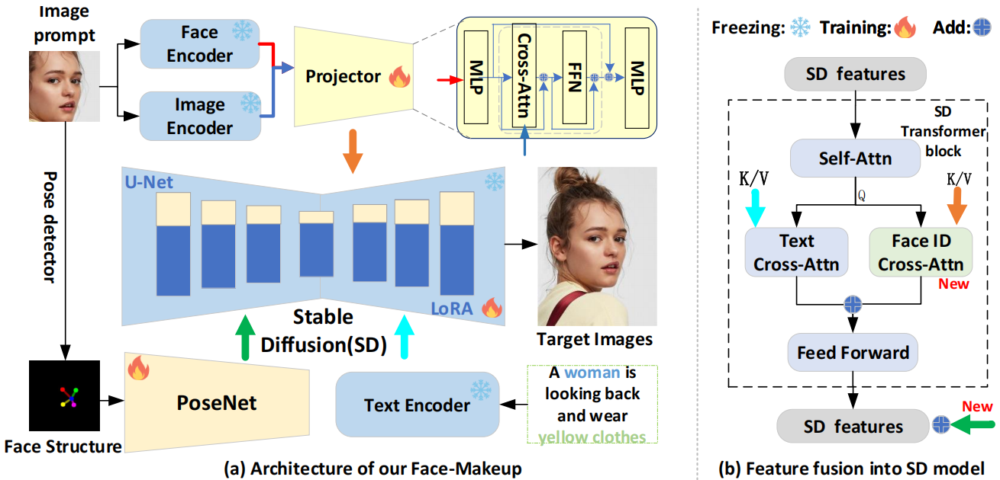

# FaceMaker-V0

## News and Update 🔥🔥🔥

- Dec.28, 2024. [FaceMaker-V0](https://github.com/ddw2AIGROUP2CQUPT/HumanVLM), **is released!**👏👏👏

## Demo

https://github.com/user-attachments/assets/392f4f86-92e2-4c28-b8a7-fb724b098678

## FaceCaptionHQ-4M

We constructed a large-scale facial image-text dataset for facial image generation task.

## Model

## Results
**Unsplash-Face**

| Method            | CLIP-T ↑ | CLIP-I ↑ | DINO ↑   | FaceSim ↑ | FID ↓     | Attr_c ↑ | VLM-score ↑ |
| ----------------- | -------- | -------- | -------- | --------- | --------- | -------- | ----------- |
| Ip-Adapter.(2023) | 27.7     | 64.9     | 37.6     | 53.2      | 226.9     | 3.0      | 65.3        |
| PhotoMaker.(2023) | 28.2     | 56.5     | 26.2     | 20.7      | 224.4     | 2.2      | 60.1        |
| InstantID.(2024)  | 24.8     | 78.0     | 49.4     | **71.2**  | 178.7     | 3.8      | 54.8        |
| Pulid.(2024)      | **29.3** | 46.3     | 21.0     | 24.3      | 284.5     | 2.4      | 36.5        |
| Ours              | 22.3     | **82.1** | **73.2** | 69.2      | **130.1** | **4.0**  | **79.6**    |

**FaceCaption**

| Method            | CLIP-T ↑  | CLIP-I ↑ | DINO ↑   | FaceSim ↑ | FID ↓    | Attr_c ↑ | VLM-score ↑ |
| ----------------- | --------- | -------- | -------- | --------- | -------- | -------- | ----------- |
| Ip-Adapter.(2023) | 26.78     | 69.7     | 48.0     | 59.2      | 195.4    | 3.2      | 63.2        |
| PhotoMaker.(2023) | 28.12     | 50.5     | 25.9     | 22.1      | 237.6    | 2.2      | 54.5        |
| InstantID.(2024)  | 24.29     | 67.2     | 50.1     | 75.5      | 166.5    | 5.3      | 53.7        |
| Pulid.(2024)      | **29.21** | 36.2     | 13.2     | 22.8      | 298.5    | 2.1      | 43.5        |
| Ours              | 21.96     | **87.4** | **79.4** | **77.8**  | **95.4** | **6.3**  | **73.1**    |
